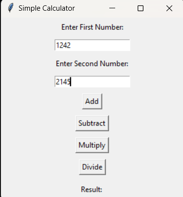

# GUI Calculator

## **Description**
A graphical user interface (GUI)-based calculator that performs basic arithmetic operations such as addition, subtraction, multiplication, and division. Built using Python's **Tkinter** library, this project provides a simple and intuitive interface for performing calculations.

---

## **Features**
- User-friendly GUI for basic arithmetic operations.
- Buttons for digits (0-9) and arithmetic operators (+, -, *, /).
- Clear button to reset the input field.
- Equal button to display the result.
- Input field to display ongoing and final calculations.

---

## **Requirements**
- Python 3.x
- Tkinter (pre-installed with Python)

---

## **How to Run**
1. Save the code as `gui_calculator.py`.
2. Run the script using the following command:
   ```bash
   python gui_calculator.py
   ```

## **Screenshot**


